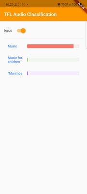

# Real-time Audio Classification Flutter

Real-time Audio Classification in flutter. It uses:

* Interpreter API from TFLite Flutter Plugin.
* TensorAudio API from TFLite Flutter Support Library.
* [YAMNet](https://tfhub.dev/google/lite-model/yamnet/classification/tflite/1),
  an audio event classification model.

<p align="center">
  
</p>

## Build and run

### Step 1. Clone TFLite Flutter Helper repository

Clone TFLite Flutter Helper repository to your computer to get the demo
application.

```
git clone https://github.com/am15h/tflite_flutter_helper
```

### Step 2. Run the application

```
cd example/audio_classification/
flutter run
```

## Resources used:

*   [TensorFlow Lite](https://www.tensorflow.org/lite)
*   [Audio Classification using TensorFlow Lite](https://www.tensorflow.org/lite/examples/audio_classification/overview)
*   [YAMNet audio classification model](https://tfhub.dev/google/lite-model/yamnet/classification/tflite/1)
