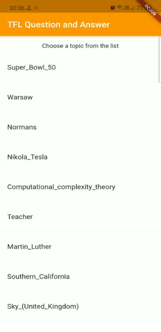

# Bert Question Answer Demo

Sample app for Bert Question Answer in using the TFLite Flutter Task Library.

### Steps to run

Download `lite-model_mobilebert_1_metadata_1.tflite` from [here](https://tfhub.dev/tensorflow/lite-model/mobilebert/1/metadata/1?lite-format=tflite) and place in `assets/`.

### Demo

